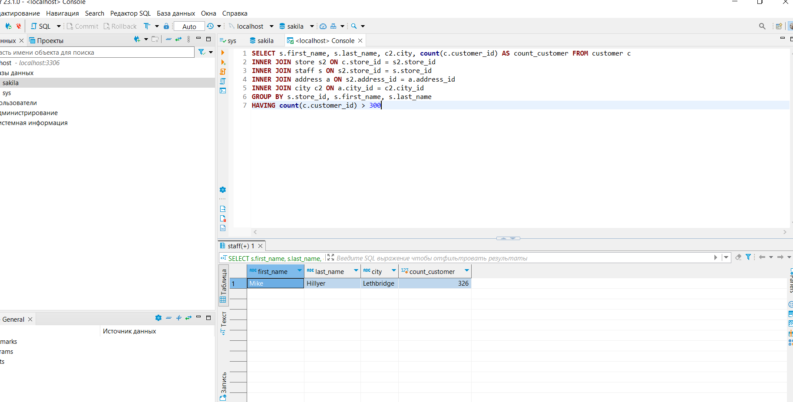
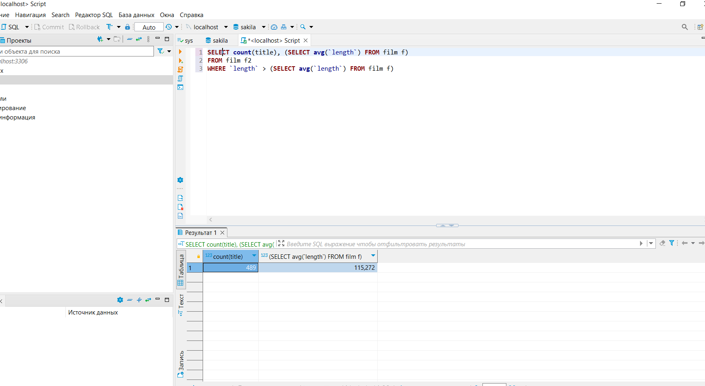

#  `Домашнее задание к занятию «SQL. Часть 2» - Зозуля Максим`

---

Задание можно выполнить как в любом IDE, так и в командной строке.

### Задание 1

Одним запросом получите информацию о магазине, в котором обслуживается более 300 покупателей, и выведите в результат следующую информацию: 
- фамилия и имя сотрудника из этого магазина;
- город нахождения магазина;
- количество пользователей, закреплённых в этом магазине.

### Задание 2

Получите количество фильмов, продолжительность которых больше средней продолжительности всех фильмов.

### Задание 3

Получите информацию, за какой месяц была получена наибольшая сумма платежей, и добавьте информацию по количеству аренд за этот месяц.

